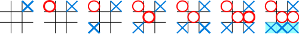

Link: https://www.hackerrank.com/challenges/tic-tac-toe

## My strategy 

Using minimax and alpha-beta pruning, all games are tied. 

## Description

Tic-tac-toe is a pencil-and-paper game for two players, X (ascii value 88) and O (ascii value 79), who take turns marking the spaces in a 3×3 grid. The player who succeeds in placing three respective marks in a horizontal, vertical, or diagonal row wins the game. Empty space is represented by _ (ascii value 95), and the X player goes first.

Here is an example game won by the first player, X:



The function nextMove takes in a char player, and the 3x3 board as an array. Complete the function to print 2 space separated integers r and c which denote the row and column that will be marked in your next move. The top left position is denoted by (0,0).

## How does it work? 
Your code is run alternately with the opponent bot for every move.

## Example input:

```
X  
___  
___  
_XO  
```
## Example output:

```
1 0 
```
## Explanation: 
The board results in the following state after the above move

```
___  
X__  
_XO  
```